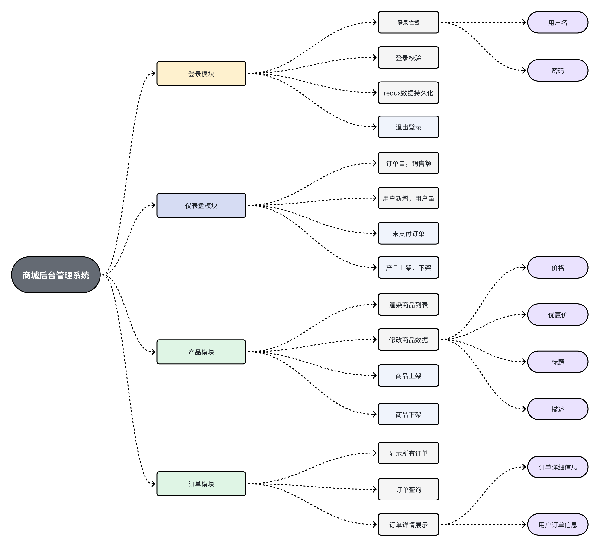

# shopping-store-admin
基于`React`+`Ts`开发的商城后台管理项目
## 项目背景

### 项目前言

由于数据库部署在[TiDB](https://tidbcloud.com/)，学生在后端[store-server](https://github.com/codeshihaoran/shopping-store-server)中配置了.env文件，来存储数据库的信息，所以项目clone到本地之后获取不到数据。

### 项目来源
shopping-Admin的开发源于学生在上半年期间开发的[shopping-store](https://github.com/codeshihaoran/shopping-store-frontendshopping-store)的商品，订单，用户等等做了后台管理化的处理。目的是为了更好的管理数据，不再手改数据库来测试数据。更是为了锻炼`React`和`TypeScript`的项目实战经验
## 技术栈
+ 前端：`React`+`TypeScript`+`Redux`+`React-router`+`Webpack`+`antd`
+ 后端：`node.js`+`koa`
+ 数据库：`MySql`+`TiDB`
## 流程图预览


## 功能特性
### 登录
+ 登录拦截
+ 登录校验
+ `redux`实现登录状态持久化
+ 退出登录
### 仪表盘
+ 订单量，销售量
+ 用户新增，用户量
+ 产品上架，下架
+ 未支付订单
### 商品
+ 渲染商品列表
+ 修改商品数据
  + 价格
  + 标题
  + 描述
  + 优惠价
+ 新增商品
+ 商品下架 
### 订单
+ 显示所有订单
+ 订单查询功能
+ 订单详情展示
  + 展示订单的详细信息
  + 展示用户订单信息
### 用户
+ 渲染用户列表
+ 根据用户查找订单记录
## 安装依赖
```sh
npm install
```
## 项目运行

```sh
npm run dev
```
## 项目打包
```sh
npm run build
```